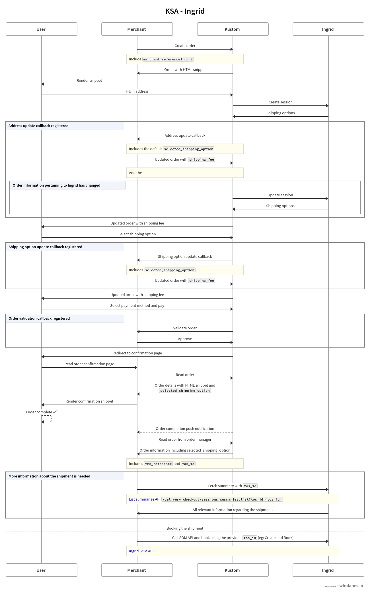

# Integrating Ingrid with Kustom Checkout

This guide is for platform partners and integration engineers connecting [Ingrid](https://www.ingrid.com/) as the shipping provider behind Kustom Checkout. It covers how to set up the integration, what shipping data is exposed before and after purchase, and how split-shipping changes the order structure.

Ingrid is integrated through **Kustom Shipping Assistant (KSA)** using the **Ingrid Headless** Transport Management System (TMS) connector. KSA fetches shipping options from Ingrid during checkout and maps them onto Kustom's order model, so the merchant works with a single, consistent order representation.

For exact request and response details, refer to the linked API reference pages in each section.

## Overview

A complete Ingrid + Kustom checkout has two cooperating systems:

- **Ingrid** owns the carriers, delivery options, pickup locations, addons, and the merchant-facing tooling in the Ingrid Merchant Platform (IMP).
- **Kustom Checkout**, through KSA and the Ingrid Headless TMS connector, requests shipping options from Ingrid, renders them to the buyer, and records the buyer's choice on the order.

The end-to-end flow — order creation, shipping selection, completion, and shipment booking — is illustrated below.

[Open the Ingrid integration flow diagram](https://swimlanes.io/u/c_4aDT5D_M)

The rest of this guide is organised around the order lifecycle: [setting up](#setting-up) the connection, the [pre-purchase](#pre-purchase) flow while the order is still `checkout_incomplete`, the [post-purchase](#post-purchase) flow once the order is complete, and [split-shipping](#split-shipping) for orders fulfilled by more than one shipment.

## Setting up

Setting up the integration is done in two places: Ingrid and Kustom.

### 1. Set up Ingrid

Sign up for the **Ingrid Merchant Platform (IMP)** and configure your carriers, delivery options, and other shipping settings there. See Ingrid's [Access to Ingrid Merchant Platform](https://support.ingrid.com/space/KB/11534345/Access+to+Ingrid+Merchant+Platform) article and the setup guides available within Ingrid.

You will need the following from Ingrid to complete the Kustom setup:

- Your **Ingrid Site ID**.
- Your **Ingrid private key** — the plain key, **not** the base64-encoded variant.

### 2. Set up Kustom Checkout

The general Shipping Assistant setup is documented in [How to Set Up Shipping Assistant in Kustom Checkout](https://docs.kustom.co/contents/checkout/shipping-assistant/overview#how-to-set-up-shipping-assistant-in-kustom-checkout). Follow that guide, with the following Ingrid-specific details.

**Preparation.** The general guide's note on digital products does not apply to the Ingrid integration — digital products are handled on Ingrid's side by tagging them with a `digital` tag rather than through Kustom configuration. You can skip the digital-products step when integrating Ingrid.

**Shipping credentials.** When activating KSA in the Kustom Portal, configure the connection as follows:

| Field | Value |
|---|---|
| **TMS** | Select **Ingrid Headless**. Available in both Playground and Production. |
| **Identifier** | Your Ingrid Site ID. |
| **Key** | Your Ingrid private key — the plain key, not base64-encoded. |

In **Playground**, the Ingrid Headless TMS connects to Ingrid's **staging** environment; in **Production**, it connects to Ingrid's **production** environment.

The remaining setup steps — activating KSA in the Portal, triggering KSA in the checkout payload, and verifying the setup in Playground — are unchanged from the general Shipping Assistant guide.

### Merchants running a dual-iframe checkout

Some merchants currently run a dual-iframe checkout during a transition period — an Ingrid iframe on top and a Kustom iframe below. Such merchants may need to keep collecting a separate shipping address while *not* yet showing shipping options sourced from Ingrid inside Kustom.

To suppress option fetching, pass [`options.tms_configuration_override.disabled`](https://docs.kustom.co/contents/api/checkout/other/createordermerchant#other/createordermerchant/t=request&path=options/tms_configuration_override/disabled) as `true` when creating the order. Kustom will then collect the address but will not fetch shipping options from Ingrid.

## Pre-purchase

The pre-purchase flow covers everything after the order is created but before it is completed — that is, while the order's [`status`](https://docs.kustom.co/contents/api/checkout/other/createordermerchant#other/createordermerchant/t=response&c=201&path=status) is `checkout_incomplete`.

### Selected shipping option

The [`selected_shipping_option`](https://docs.kustom.co/contents/api/checkout/other/createordermerchant#other/createordermerchant/t=response&c=201&path=selected_shipping_option) attribute — present both in the order response and in callbacks — describes the shipping option the buyer chose. Its fields are populated from Ingrid as follows:

| Field | Mapped from |
|---|---|
| `id` | The shipping option ID generated by Ingrid |
| `name` | The `display_name` of the Ingrid `delivery_category` |
| `description` | Not provided |
| `promo` | Not provided |
| `price` | The price of the Ingrid `delivery_option` |
| `preselected` | Not provided |
| `tax_rate` | Defaults to 25% — see [Tax calculation on shipping options](#tax-calculation-on-shipping-options) |
| `tax_amount` | Calculated from the defaulted 25% `tax_rate` |
| `shipping_method` | KSA's representation of Ingrid's delivery type and location type — see the table below |
| `tms_reference` | Ingrid's session ID |
| `tos_id` | Available post-purchase only |

#### Shipping method mapping

`shipping_method` is derived from Ingrid's `delivery_type` and, where available, `location_type`:

| Ingrid delivery type | Ingrid location type | KSA `shipping_method` |
|---|---|---|
| — | `LOCATION_TYPE_UNSPECIFIED` | `Undefined` |
| — | `LOCKER` | `PickUpPoint` |
| — | `STORE` | `PickUpPoint` |
| — | `POSTOFFICE` | `PickUpPoint` |
| — | `MANNED` | `PickUpPoint` |
| `DELIVERY_TYPE_UNSPECIFIED` | — | `Undefined` |
| `DELIVERY` | — | `Home` |
| `MAILBOX` | — | `Postal` |
| `PICKUP` | — | `PickUpPoint`, or `Home` if no locations are available |
| `INSTORE` | — | `PickUpStore`, or `Home` if no locations are available |

#### Delivery details

`selected_shipping_option.delivery_details` carries the carrier and logistics detail:

- `carrier` — KSA's supported carrier, decoded from Ingrid's carrier name
- `class` — always `STANDARD`
- `product`
  - `identifier` — Ingrid's carrier product ID
  - `name` — Ingrid's carrier name
- `timeslot`
  - `id` — Ingrid's generated shipping option ID for the timeslot
  - `start` — timeslot start time
  - `end` — timeslot end time
- `pickup_location`
  - `id` — the numeric ID of the location, as per Ingrid
  - `name` — the name of the location
  - `address` — the address of the location

#### Selected addons

`selected_shipping_option.selected_addons` is an array, with one entry per chosen addon:

- `type` — Ingrid's ID of the addon
- `price` — the price of the addon
- `external_id` — the `external_id` of the addon as defined in Ingrid

### Tax calculation on shipping options

Ingrid does not calculate tax, so KSA defaults `tax_rate` on the selected shipping option to **25%** (and derives `tax_amount` from it). To avoid overpaying tax, merchants and platforms should apply the correct tax for the shipping option based on the cart.

To do this, implement the [shipping option update callback](https://docs.kustom.co/contents/api/checkout-callback/other/updateshippingoption) and return one or more `shipping_fee` order lines on the order in the callback response. These override the defaulted `tax_rate` and `tax_amount`.

### Merchant references

The merchant's order references — [`merchant_reference1`](https://docs.kustom.co/contents/api/checkout/other/createordermerchant#other/createordermerchant/t=request&path=merchant_reference1) and [`merchant_reference2`](https://docs.kustom.co/contents/api/checkout/other/createordermerchant#other/createordermerchant/t=request&path=merchant_reference2) — are propagated to Ingrid so that orders can be found easily in the Ingrid Merchant Platform.

> **⚠️ Important — send merchant references before completion.** Provide the merchant references **before the order is completed** so that they can be sent to Ingrid. If they are missing at completion time, Kustom passes its own [`order_id`](https://docs.kustom.co/contents/api/checkout/other/createordermerchant#other/createordermerchant/t=response&c=201&path=order_id) as the `external_id` of the Ingrid session instead.
>
> Kustom does not update the Ingrid session after the order is completed. Sending merchant references to the Order Management API afterwards will therefore **not** propagate them to Ingrid.

## Post-purchase

The post-purchase flow covers the order once it is complete, including retrieving shipping information and booking the shipment with Ingrid.

### Shipping information from Kustom

Shipping information remains available after the order is complete. Both `tms_reference` and `tos_id` are found on the [`selected_shipping_option`](https://docs.kustom.co/contents/api/order-management/orders/getorder#orders/getorder/t=response&c=200&path=selected_shipping_option), in the Checkout API and the Order Management API alike.

The `tos_id` is usually all that is needed to book a shipment, since Ingrid auto-fills the remaining information. If another system needs more detail, the `tos_id` can be used to fetch the full shipment information from Ingrid via the [`sessions_summaries.list`](https://api-stage.ingrid.com/v1/delivery_checkout/_/swagger/#/default/DeliveryCheckout_ListSessionsSummaries) API.

### Booking shipments with Ingrid

Because the Ingrid Headless API shares much of its model with the Ingrid delivery checkout API, the `tos_id` is enough for Ingrid to have all the information required to create a shipment.

To fulfil the order, the merchant creates and books the shipment with Ingrid using Ingrid's SOM API, providing the `tos_id` from the order's `selected_shipping_option`.

## Split-shipping

The split-shipping flow is illustrated in the [split-shipping flow diagram](https://swimlanes.io/u/I6QU7uzTky).

### What it is

A single order can be fulfilled by more than one shipment. For example, when goods come from multiple warehouses, or need to be shipped separately for any other reason, split-shipping is the way to model that.

### How it differs from a single shipment

The pre-purchase and post-purchase flows are nearly identical for split-shipping. The differences are in how the order is set up and in the structure of the selected shipping options.

### Deliveries

The `deliveries` array holds information about each shipment. Every order line — except lines of [`type`](https://docs.kustom.co/contents/api/checkout/other/createordermerchant#other/createordermerchant/t=request&path=order_lines/type) `gift_card` and `store_credit` — must be assigned to a delivery via `order_lines[].shipping_attributes.delivery_id`.

There is no enforced limit on the number of deliveries an order can have.

### Selected shipping options

A split-shipping order naturally has more than one selected shipping option. The Checkout API, the callback API, and the Order Management API therefore expose an additional `selected_shipping_options` attribute: an array whose entries have the same structure as [`selected_shipping_option`](https://docs.kustom.co/contents/api/checkout/other/createordermerchant#other/createordermerchant/t=response&c=201&path=selected_shipping_option), one per selected shipping option.
