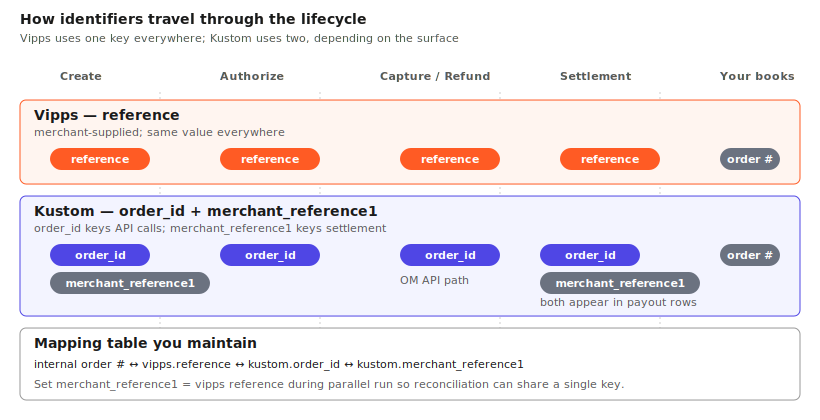
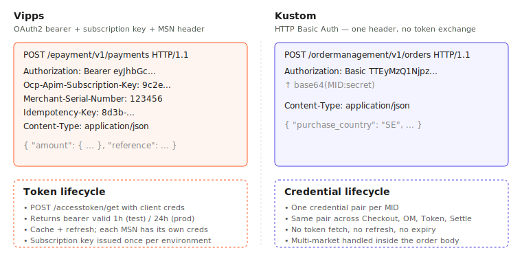
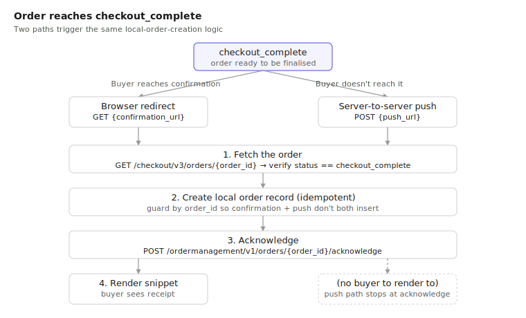
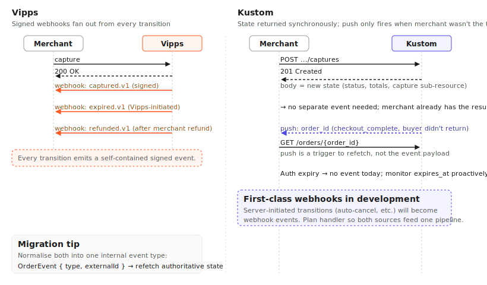

# Migrating from Vipps Checkout to Kustom Checkout

This guide is for platform partners and integration engineers who already have a Vipps Checkout integration and need to add Kustom Checkout alongside it. It walks through the conceptual model of each product, where they differ, and how to plan the migration.

For exact request and response details, refer to the linked API reference pages in each section.

On this page

- [Cheat sheet](#cheat-sheet)
- [Overview](#overview)
- [Core concepts](#core-concepts)
- [Before you get started](#before-you-get-started)
- [Checkout](#checkout)
- [Order management](#order-management)
- [Settlements and reconciliation](#settlements-and-reconciliation)
- [Migration approach](#migration-approach)
- [Special use cases](#special-use-cases)
- [Migration gotchas](#migration-gotchas)
- [Appendix](#appendix)

---

## Cheat sheet

| Concept | Vipps Checkout | Kustom Checkout |
|---|---|---|
| Merchant identity | Merchant Serial Number (MSN), one per sales unit | Merchant ID (MID), one per merchant, multi-market |
| Auth | OAuth2 bearer + subscription key + MSN header | HTTP Basic Auth |
| Checkout primitive | Short-lived session (~1h), then payment resource | Persistent order with single `order_id` |
| Primary key | Merchant-supplied `reference` | Kustom-generated `order_id` (+ `merchant_reference1`) |
| UI surface | Redirect to Vipps-hosted page | Inline iframe on merchant page (redirect fallback available) |
| Order management API | ePayment API | Order Management API |
| State propagation | Signed webhooks for every transition | Synchronous response + push-to-refetch |
| Recurring | Agreement + scheduled charges | Customer token + merchant-driven replay |
| Settlement key | `reference` | `merchant_reference1` |

---

## Overview

Vipps MobilePay has sold the Vipps Checkout product to Kustom, and existing Vipps Checkout merchants are being migrated to Kustom Checkout. As a platform partner, your role is to integrate Kustom Checkout so that merchants can move over with as little disruption as possible.

Vipps Checkout is a wallet-led, redirect-style checkout: a session is created server-to-server, the buyer is redirected to a Vipps-hosted page, and after authorization the merchant operates on a payment via the ePayment API.

Kustom Checkout is a multi-method, embedded checkout. Kustom renders the UI inside an iframe on the merchant's checkout page and supports card, invoice, BNPL, direct debit, Apple Pay, Google Pay, and Vipps/MobilePay as payment options within the same flow.

The two products share the same lifecycle — create, authorize, capture, refund or cancel, reconcile — but differ in how that lifecycle is modeled, identified, and exposed.

---

## Core concepts

| Concept | Vipps | Kustom |
|---|---|---|
| Checkout primitive | Short-lived **session** (~1h). After authorization, the durable object is a **payment** in the ePayment API. | Single **order** that persists from creation through settlement, identified by `order_id`. Two APIs (Checkout, Order Management) share the same id. |
| Status transitions | Session → authorized payment | `checkout_incomplete` → `checkout_complete` → `AUTHORIZED` → `CAPTURED` / `PART_CAPTURED` / `CANCELLED` |
| Identifier | Merchant-supplied `reference`, used everywhere | Kustom-generated `order_id` for API calls; `merchant_reference1` for settlements |
| Amounts | Minor units; line items used for display, validated by amount | Minor units; line items required and must reconcile exactly to order total including tax |

**Acknowledge** is unique to Kustom. After the iframe completes, the merchant should `POST /ordermanagement/v1/orders/{order_id}/acknowledge` to confirm awareness of the order. Order Management calls work without it, but acknowledge plus the push fallback closes the gap when a buyer pays in Kustom but never reaches the merchant's confirmation page (network drop, closed tab, app switch).

**Identifier mapping** — keep a stable, indexed table mapping Kustom `order_id` ↔ Vipps `reference` ↔ your internal order number from the start.

**Line-item reconciliation** is the most common source of onboarding friction. Kustom requires each line to declare quantity, unit price, tax rate, total amount, and total tax, and the sum must reconcile exactly to the order total in minor units. Discounts are expressed as line items. This discipline also flows into Order Management, where captures and refunds work best when line references are supplied.

References: [Kustom Checkout overview](https://docs.kustom.co/contents/checkout), [Order Management introduction](https://docs.kustom.co/contents/order-management), [Create an order](https://docs.kustom.co/contents/api/checkout/other/createordermerchant).

---

## Before you get started

### Merchant identity and authentication

| | Vipps | Kustom |
|---|---|---|
| Identity | Merchant Serial Number (MSN), six-digit numeric, one per sales unit | Merchant ID (MID), format `Mxxxxxx`, one per merchant covering multiple markets |
| Multi-store / multi-market | One MSN (and credential pair) per store | Single MID; market selected by `purchase_country` + `purchase_currency` on each order |
| Auth scheme | OAuth2 bearer token + Azure subscription key | HTTP Basic Auth |
| Headers | `Authorization: Bearer <token>`, `Ocp-Apim-Subscription-Key: <key>`, `Merchant-Serial-Number: <MSN>` | `Authorization: Basic base64(username:shared_secret)` |
| Token lifetime | 1h test / 24h prod, must be cached and refreshed | None — no token exchange |
| Credential scope | Per MSN | One credential pair spans Checkout, Order Management, Customer Token, and Settlements APIs |

**Implication:** the credential model is simpler on Kustom, but the platform's merchant-configuration UI must make multi-market merchants explicit. Map each existing Vipps MSN to a Kustom MID + market combination during design.

During parallel running, both auth models must coexist behind a clean abstraction. Once Vipps is retired, the token-cache and subscription-key handling can be removed.

References: [Vipps Access Token API](https://developer.vippsmobilepay.com/api/access-token/), [Vipps API keys](https://developer.vippsmobilepay.com/docs/knowledge-base/api-keys/), [Kustom Authentication](https://docs.kustom.co/api/authentication).

---

## Checkout

### Flow comparison

| | Vipps | Kustom (inline) |
|---|---|---|
| Create | `POST /checkout/v3/session` | `POST /checkout/v3/orders` |
| Required input | Amount, currency, merchant reference, callback + return URLs | Country, currency, locale, order lines (reconciling), totals, `merchant_urls` |
| Response | `checkoutFrontendUrl` | `html_snippet` (HTML + script loader) |
| UI surface | Buyer redirected to Vipps-hosted page | Snippet injected into checkout page; Kustom renders the form in-iframe |
| Buyer leaves merchant site? | Yes | No |
| Abandoned session | Create new session for same reference | Order persists; resume in same iframe |
| Callbacks | Single `callbackUrl` + `returnUrl` | Per-order `merchant_urls` (see below) |

### Merchant URLs (Kustom)

Kustom communicates with the merchant through per-order callback URLs declared at order creation in `merchant_urls`:

- `confirmation` — page the buyer is redirected to after the iframe. Primary completion handoff; where the merchant finalises the order.
- `push` — server-to-server callback when the order reaches `checkout_complete`. Fallback when the buyer doesn't reach the confirmation page.
- `terms` — merchant's terms and conditions, displayed in the iframe.
- `checkout` — used by Kustom for back-navigation from the iframe.
- `validation` (optional) — server-to-server hook called before placing the order, so the merchant can run last-mile checks like inventory.
- `notification` (optional) — server-to-server callback for non-synchronous outcomes such as fraud review or pending-payment status.

Templated placeholders (`{checkout.order.id}`) are substituted by Kustom. Push and notification payloads are minimal — usually just the `order_id` in the URL — and the handler is expected to fetch the latest state from the API rather than trust the body. Authenticity comes from Kustom's published egress IP ranges; an HMAC parameter can be encoded into the URL if cryptographic verification is required.

### Confirmation page handler

After the buyer completes the iframe, Kustom redirects them to the `confirmation` URL with `order_id` substituted in. The handler must:

1. `GET /checkout/v3/orders/{order_id}` and verify status `checkout_complete`.
2. Create the local order record.
3. `POST /ordermanagement/v1/orders/{order_id}/acknowledge`.
4. Render the confirmation `html_snippet` from the order response.

From step 3 on, the order lives in Order Management. The push handler runs the same logic when the buyer doesn't reach the confirmation page, so the local record is created exactly once either way.

On Vipps, the `returnUrl` is essentially just where the buyer lands; on Kustom, the confirmation page is an active integration point.

### Hosted Payment Page (HPP)

For platforms whose architecture only supports a redirect-style checkout and cannot embed an inline iframe, Kustom offers the **Hosted Payment Page (HPP)**: Kustom hosts the checkout on its own domain and the buyer is redirected to it, in the same model as Vipps Checkout today. HPP is feature-equivalent for the buyer and unlocks the same set of payment methods, but the embedded experience is the recommended default — HPP is purely the fallback when redirect is structurally required by the platform.

Reference: [Hosted Kustom Checkout integration](https://docs.kustom.co/contents/checkout/hosted-payment-page/before-you-start/hpp-integration).

### Front-end implications

An inline integration adds: a container element for the snippet, optional listeners for iframe JS events (`shipping_address_change`, `billing_address_change`, `change`), a CSP that permits Kustom's iframe domains and scripts, and a confirmation page that renders the confirmation snippet. None of this exists in Vipps. The natural place is the platform's checkout template, not the payment-method module.

References: [Create order](https://docs.kustom.co/contents/checkout/integrate-kco-in-your-ecommerce/create-order), [Checkout API reference](https://docs.kustom.co/contents/api/checkout), [Vipps Checkout API guide](https://developer.vippsmobilepay.com/docs/APIs/checkout-api/checkout-api-guide/).

---

## Order management

### Operations

| Operation | Vipps ePayment (key: `reference`) | Kustom Order Management (key: `order_id`) |
|---|---|---|
| Capture | `POST /epayment/v1/payments/{reference}/capture` | `POST /ordermanagement/v1/orders/{order_id}/captures` |
| Refund | `POST /epayment/v1/payments/{reference}/refund` | `POST /ordermanagement/v1/orders/{order_id}/refunds` |
| Cancel | `POST /epayment/v1/payments/{reference}/cancel` | `POST /ordermanagement/v1/orders/{order_id}/cancel` |
| Get | `GET /epayment/v1/payments/{reference}` | `GET /ordermanagement/v1/orders/{order_id}` |
| Events / history | `GET /epayment/v1/payments/{reference}/events` | Order read; captures and refunds are addressable sub-resources |
| Acknowledge | — | `POST /ordermanagement/v1/orders/{order_id}/acknowledge` |
| Update authorization | — | `PATCH /ordermanagement/v1/orders/{order_id}/authorization` |
| Update merchant refs | — | `PATCH /ordermanagement/v1/orders/{order_id}/merchant-references` |
| Add shipping info | — | `POST /ordermanagement/v1/orders/{order_id}/shipping-info` |
| Partial captures / refunds | Repeated calls with `modificationAmount`; running totals in `aggregate` | Each `POST` creates a sub-resource with its own URL in the `Location` header |
| Idempotency | `Idempotency-Key` header | Idempotency key supported, strongly recommended |

References: [Kustom Capture and Track Orders](https://docs.kustom.co/contents/order-management/manage-orders-with-the-api/capture-and-track-orders), [Refund Orders](https://docs.kustom.co/contents/order-management/manage-orders-with-the-api/refund-and-extend-orders).

### State propagation

| | Vipps | Kustom |
|---|---|---|
| Mechanism | Signed webhooks per event type | Synchronous API response + minimal push (refetch trigger) |
| Who drives state? | Buyer, merchant, and Vipps itself (expiry, terminate, abort) | Merchant for capture/refund/cancel; Kustom for auth expiry |
| Payload | Self-contained signed event | URL with `order_id` — fetch latest state |
| Registration | `POST /webhooks/v1/webhooks` per MSN; up to 25 per event type | Per-order `push` URL in `merchant_urls` |
| Delivery | Per-payment ordered queue; failure blocks subsequent events | Best-effort push; first-class webhooks in development |

Vipps event types include `epayments.payment.created.v1`, `authorized.v1`, `captured.v1`, `refunded.v1`, `cancelled.v1`, `expired.v1`, `terminated.v1`, `aborted.v1`.

**Auto-cancel on Kustom** — if the authorization window passes without a capture, Kustom releases the reservation and the order moves to cancelled. Today this surfaces when the merchant reads the order; monitor `expires_at` proactively. Card windows are typically weeks; invoice and BNPL can be longer.

References: [Vipps Webhooks API guide](https://developer.vippsmobilepay.com/docs/APIs/webhooks-api/api-guide/), [event types](https://developer.vippsmobilepay.com/docs/APIs/webhooks-api/events/), [request authentication](https://developer.vippsmobilepay.com/docs/APIs/webhooks-api/request-authentication/).

---

## Settlements and reconciliation

| | Vipps Report API | Kustom Settlements API |
|---|---|---|
| Shape | Transaction-level + settlement-level summaries; paginated cursor queries by date range | One settlement report per payout, with order-level rows |
| Reconciliation key | `reference` | `merchant_reference1` |
| Drill-down | Payout → individual `reference` values | List payouts, get payout by reference, full payout-with-transactions, flat transactions by date |
| Adjustments | — | Refunds issued after a payout appear as negative entries in the next payout |
| Row fields (Kustom) | — | `order_id`, `merchant_reference1`, `merchant_reference2`, type, amount, tax, merchant fee, payment method |

During parallel running, set `merchant_reference1` to the same value used for the Vipps `reference` so the reconciliation pipeline can share a single key.

References: [Vipps Report API](https://developer.vippsmobilepay.com/docs/APIs/report-api/report-api-quick-start/), [Kustom Settlement reports](https://docs.kustom.co/contents/order-management/settlements/settlement-reports).

---

## Migration approach

| Phase | Goal | Key actions |
|---|---|---|
| 1. Orient and design | Internalise the differences | Stand up a Kustom playground; walk through one happy-path flow (create → iframe → push → acknowledge → capture → refund); audit the Vipps integration for hidden coupling (reference = internal order number, line totals that don't reconcile, idempotency reliance) |
| 2. Build behind a flag | Implement as a new module | Acknowledge, line-item reconciliation, push handler (HMAC-in-URL if required), record-then-call idempotency, Order Management admin UI before going live |
| 3. Pilot | Validate under real volume | Route a subset of new traffic for 1–2 engaged merchants; compare auth rate, capture latency, refund flow, settlement reconciliation, support tickets; iterate on rounding and iframe styling. Do **not** migrate recurring agreements yet |
| 4. Wider rollout | Default new orders to Kustom | Switch the default across the merchant base; keep Vipps available for unmigrated merchants; bulk of partner communication happens here |
| 5. Subscription cutover | Move recurring to Kustom tokens | Stop creating new Vipps Recurring agreements; build re-consent at next renewal for existing agreements; replace in-app advance notice with merchant-owned email/SMS if your market requires it |
| 6. Sunset | Retire Vipps | After 6–12 months (longest refund + auth windows), deregister webhook subscriptions, archive credentials, remove integration code; keep historical Vipps data accessible for accounting and disputes |

**Architectural framing:** treat Kustom as a new *checkout provider*, not a new *payment method*. Kustom is itself a checkout layer that contains payment methods.

### What to communicate to merchants

- **Checkout UI changes shape.** Iframe, not redirect — themes, scripts, and third-party tags need revalidation. Buyers stay on the merchant's site.
- **Subscriptions require re-consent.** Active Vipps Recurring subscribers cannot be silently moved. Communicate this early to subscription-heavy verticals.
- **Order admin tooling changes underneath.** Underlying API calls change; the admin UI can stay the same if you wrap it.
- **Line items, tax, and discounts must reconcile.** Merchants with bespoke discount or rounding logic may need cart cleanup.
- **Settlement reports change.** Provide a side-by-side cheat sheet during the transition.

Lead with: **Kustom is a superset, not a replacement.** Vipps and MobilePay remain available inside Kustom Checkout, and the checkout experience moves into the merchant's storefront.

---

## Special use cases

### Subscriptions and recurring payments

The two products use fundamentally different recurring models and cannot be migrated transparently for existing subscribers.

| | Vipps Recurring | Kustom Customer Token |
|---|---|---|
| Model | Agreement (with `agreementId`) + scheduled charges | Token-and-replay |
| Setup inside the checkout flow | Create the Checkout session with `type: SUBSCRIPTION` (InitiateSubscriptionSessionRequest); buyer accepts the agreement in Vipps app; response carries `agreementId` | Create the order with `recurring: true` (and optional `recurring_description`); completed order response carries `recurring_token` |
| Setup outside Checkout | Standalone Recurring API: `POST /recurring/v3/agreements`, redirect buyer to `vippsConfirmationUrl`, poll until `ACTIVE` | n/a — token is always issued by a completed Kustom order |
| Each billing cycle | Merchant `POST /recurring/v3/agreements/{agreementId}/charges`, at least a couple of days in advance | Merchant `POST /customer-token/v1/tokens/{token}/order`; order created authorized, no buyer interaction |
| Scheduling | Built into agreement; Vipps surfaces upcoming charges in-app | Merchant schedules and triggers each recurrence |
| Variants | Fixed-price, variable-amount, direct charge | One model; rest is regular Order Management |
| Pause / stop | Pause or stop the agreement | Read / update / cancel the token |
| Failed-charge retries | Vipps applies its own retry schedule | Synchronous failure; merchant decides whether and when to retry |
| Advance notice to buyer | In-app preview in Vipps | Not provided — merchant-owned email/SMS if required |

**Migration of existing subscribers**: consent is bound to the original Vipps agreement and cannot be silently transferred. Build a re-consent flow that prompts the buyer to complete a Kustom checkout with `recurring: true` at the next renewal cycle. Expect some attrition.

References: [Vipps Recurring API guide](https://developer.vippsmobilepay.com/docs/APIs/recurring-api/recurring-api-guide/), [Kustom Recurring / Tokenization](https://docs.kustom.co/contents/checkout/use-cases/recurring), [Customer Token API](https://docs.kustom.co/contents/api/customer-token/other/createorder).

---

## Migration gotchas

- **Reference ≠ order id.** Assuming the Vipps `reference` is also the Kustom primary key breaks both API calls and settlement reconciliation. Use `merchant_reference1` to bridge them.
- **Line totals must reconcile to the cent.** Cart layers with custom discount, tax, or rounding logic are the #1 source of `POST /orders` rejections.
- **Idempotency is on you.** Without an idempotency key, a naive retry creates a duplicate capture or refund. Record intent in your DB before the call (keyed by shipment or return id) as belt-and-braces.
- **Auth expiry isn't pushed.** Persist `expires_at` and run a job that flags orders nearing the window.
- **Push payload is a notification, not data.** Treat both Vipps webhooks and Kustom push as triggers to refetch authoritative state. Normalise both into a single internal event type (`OrderEvent { type, externalId }`) so downstream stays unchanged.

---

## Appendix

### Reference documentation

#### Vipps MobilePay

- [Vipps Checkout API guide](https://developer.vippsmobilepay.com/docs/APIs/checkout-api/checkout-api-guide/)
- [Vipps Checkout API reference](https://developer.vippsmobilepay.com/api/checkout/)
- [Vipps ePayment API — capture](https://developer.vippsmobilepay.com/docs/APIs/epayment-api/api-guide/operations/capture/)
- [Vipps ePayment API — refund](https://developer.vippsmobilepay.com/docs/APIs/epayment-api/api-guide/operations/refund/)
- [Vipps ePayment API — webhooks](https://developer.vippsmobilepay.com/docs/APIs/epayment-api/api-guide/webhooks/)
- [Vipps Webhooks API guide](https://developer.vippsmobilepay.com/docs/APIs/webhooks-api/api-guide/)
- [Vipps Recurring API guide](https://developer.vippsmobilepay.com/docs/APIs/recurring-api/recurring-api-guide/)
- [Vipps Report API quick start](https://developer.vippsmobilepay.com/docs/APIs/report-api/report-api-quick-start/)
- [Vipps API keys](https://developer.vippsmobilepay.com/docs/knowledge-base/api-keys/)

#### Kustom

- [Kustom Checkout overview](https://docs.kustom.co/contents/checkout)
- [Kustom Checkout API reference](https://docs.kustom.co/contents/api/checkout)
- [Create an order](https://docs.kustom.co/contents/api/checkout/other/createordermerchant)
- [Order Management introduction](https://docs.kustom.co/contents/order-management)
- [Order Management API reference](https://docs.kustom.co/contents/api/order-management)
- [Capture and Track Orders](https://docs.kustom.co/contents/order-management/manage-orders-with-the-api/capture-and-track-orders)
- [Refund Orders](https://docs.kustom.co/contents/order-management/manage-orders-with-the-api/refund-and-extend-orders)
- [Authentication](https://docs.kustom.co/api/authentication)
- [Recurring / Tokenization](https://docs.kustom.co/contents/checkout/use-cases/recurring)
- [Customer Token API](https://docs.kustom.co/contents/api/customer-token/other/createorder)
- [Settlement reports](https://docs.kustom.co/contents/order-management/settlements/settlement-reports)
- [Hosted Kustom Checkout integration](https://docs.kustom.co/contents/checkout/hosted-payment-page/before-you-start/hpp-integration)
