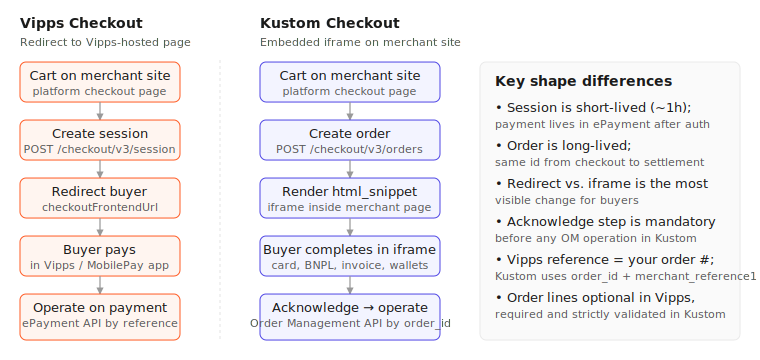
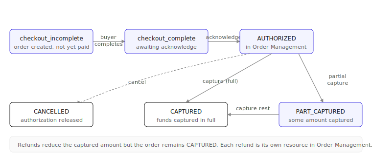
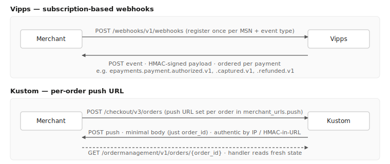
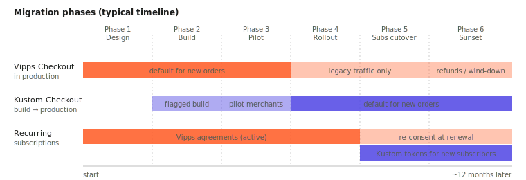
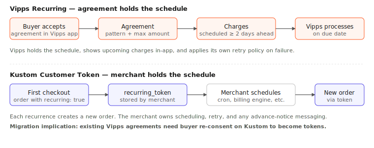

# Migrating from Vipps Checkout to Kustom Checkout

This guide is for platform partners and integration engineers who already have a Vipps Checkout integration and need to add a Kustom Checkout integration alongside it. It walks through the conceptual model of each product, where they overlap, where they differ, and how to plan the migration.

For exact request and response details, refer to the linked API reference pages in each section.

On this page

- [Overview](#overview)
- [Core concepts](#core-concepts)
- [Before you get started](#before-you-get-started)
- [Checkout](#checkout)
- [Order management](#order-management)
- [Settlements and reconciliation](#settlements-and-reconciliation)
- [Migration approach](#migration-approach)
- [Special use cases](#special-use-cases)
- [Appendix](#appendix)

---

## Overview

Vipps MobilePay has sold the Vipps Checkout product to Kustom, and existing Vipps Checkout merchants are being migrated to Kustom Checkout. As a platform partner, your role is to integrate Kustom Checkout in your platform so that merchants can move over with as little disruption as possible.

Vipps Checkout is a wallet-led, redirect-style checkout. The buyer is redirected to a Vipps-hosted page and authenticates with Vipps or MobilePay. The merchant integration is relatively narrow: a session is created server-to-server, the buyer is redirected, and after authorization the merchant operates on a payment resource through the ePayment API.

Kustom Checkout is a multi-method, embedded checkout. Kustom renders the checkout UI inside an iframe on the merchant's own checkout page and supports card, invoice, BNPL, direct debit, Apple Pay, Google Pay, and Vipps/MobilePay as payment options within the same flow. The merchant integration is broader: it covers checkout, order management, customer tokens for subscriptions, and settlements.

The two products share the same lifecycle (create checkout, authorize, capture, refund or cancel, reconcile against payouts), but they differ in how that lifecycle is modeled, identified, and exposed. The rest of this guide covers those differences.

The two flows at a glance:



---

## Core concepts

### Checkout primitive

Vipps Checkout uses a short-lived **session**, typically valid for around an hour. After the buyer authorizes the payment, the session is no longer used; the durable object is a **payment** in the ePayment API, identified by the merchant-supplied reference.

Kustom Checkout uses a single **order** that persists across the entire lifecycle, identified by a single `order_id` from creation through settlement. The same id is used by two different APIs depending on where the order is in its life:

- **Checkout API** — used while the buyer is still in the iframe. The order is in `checkout_incomplete` until the buyer authorises, then moves to `checkout_complete`.
- **Order Management API** — used after the order has been placed. The order continues through `AUTHORIZED`, `CAPTURED`, `PART_CAPTURED`, `CANCELLED`, and so on.

After the buyer completes the iframe and the order moves to `checkout_complete`, the merchant **acknowledges** the order. Acknowledge is not strictly required for the Order Management endpoints to work — all OM calls succeed against an unacknowledged order — but it is strongly recommended. Its purpose is to confirm that the merchant is aware of the order. A buyer can complete payment in Kustom but then never reach the merchant's confirmation page (network drop, closed tab, app switch), and because most platforms only create the local order record when the confirmation page is rendered, the merchant might otherwise miss it entirely. Acknowledge plus the push fallback close that gap.

The Kustom order lifecycle in one picture:



For more information, see the [Kustom Checkout overview](https://docs.kustom.co/contents/checkout) and the [Order Management introduction](https://docs.kustom.co/contents/order-management).

### Identifiers

In Vipps, the merchant supplies a `reference` when creating the session. This reference is the primary key for every subsequent operation, webhook, and settlement entry. You can use your own internal order number end-to-end.

In Kustom, the system generates an `order_id` when the order is created. Your internal order number rides along as `merchant_reference1` (and optionally `merchant_reference2`). Both identifiers travel through the order's life, but Kustom-side API calls key on the Kustom `order_id`, while settlement reports key on `merchant_reference1`.

You will want a stable, indexed mapping table between the two identifiers and your internal order number from the start.

### Line items, tax, and amounts

Both APIs use minor units for all amounts (øre, øre, cents). No floating-point money is used in either case.

Vipps Checkout accepts an order summary that is primarily used for display. Validation is amount-based.

Kustom Checkout requires complete order lines for every order. Each line declares a quantity, unit price, tax rate, total amount, and total tax. The sum of the lines must reconcile exactly to the order total, including tax. Discounts are expressed as line items. This strict line-item discipline also flows into Order Management, where captures and refunds work best when line references are supplied.

This is one of the most common sources of friction during onboarding, especially for merchants whose cart layer uses unusual discount or rounding logic.

For details, see [Create an order](https://docs.kustom.co/contents/api/checkout/other/createordermerchant) in the Kustom Checkout API reference.

---

## Before you get started

A platform partner needs two operational prerequisites in place for each merchant before any API call can be made: a merchant identity and a working set of credentials. Both differ from Vipps to Kustom.

### Merchant id

On Vipps, the merchant identity used in API calls is the **Merchant Serial Number (MSN)**: a numeric identifier (typically six digits) representing a *sales unit*. A single legal entity can hold multiple MSNs, one per store or per market it operates. The MSN is passed on every API call as a header:

```
Merchant-Serial-Number: 123456
```

Multi-store merchants therefore typically have multiple sets of Vipps credentials, one set per MSN.

On Kustom, the equivalent identity is the **Merchant ID (MID)**, in the format `Mxxxxxx` (for example `M123456`). A single MID represents a merchant account that can have **multiple markets configured underneath it** — for example one MID covering SE/SEK, NO/NOK, DK/DKK, and FI/EUR. The market used on a given order is selected by the `purchase_country` and `purchase_currency` fields on the create-order call, which must match a market enabled on the MID. The MID itself isn't a header on API calls; it is encoded in the Basic Auth username (see [Authentication](#authentication)).

The implication for platform partners is that the credential model is simpler on Kustom — typically one credential pair per merchant rather than one per sales unit — but the platform needs to know which market on the MID applies to a given checkout, and the platform's merchant-configuration UI should make multi-market merchants explicit. Mapping each existing Vipps MSN to a Kustom MID + market combination is a useful artefact to produce during the design phase.

### Authentication

#### Vipps

Vipps APIs use an OAuth2 bearer access token together with an Azure-style subscription key and the MSN on every request. The access token is obtained from the Access Token API and must be cached and refreshed.

Required headers on a typical Vipps API call:

- `Authorization: Bearer <access_token>`
- `Ocp-Apim-Subscription-Key: <subscription_key>`
- `Merchant-Serial-Number: <MSN>`

Tokens are valid for 1 hour in test and 24 hours in production. For more information, see the [Vipps Access Token API](https://developer.vippsmobilepay.com/api/access-token/) and [Vipps API keys](https://developer.vippsmobilepay.com/docs/knowledge-base/api-keys/).

#### Kustom

Kustom APIs use HTTP Basic Auth. The username is derived from the MID and a shared secret completes the pair; both are combined and base64-encoded into the `Authorization` header:

```
Authorization: Basic base64(username:shared_secret)
```

The same credentials work across the Checkout API, Order Management API, Customer Token API, and Settlements API. There is no token exchange and no subscription key.

For more information, see [Authentication](https://docs.kustom.co/api/authentication) in the Kustom API documentation.

#### Migration note

During parallel running, both authentication models must coexist behind a clean abstraction in your platform. Once Vipps Checkout is fully retired, the token-cache and subscription-key handling for Vipps Checkout-related APIs can be removed.

---

## Checkout

### Vipps Checkout

The merchant creates a session at `POST /checkout/v3/session` with the order amount, currency, merchant reference, and callback and return URLs. The response includes a `checkoutFrontendUrl`.

The buyer is redirected to that URL and pays in the Vipps or MobilePay app or with card. The session is short-lived; if the buyer abandons and returns later, the merchant creates a new session for the same reference. After authorization, the buyer is sent back to the merchant's `returnUrl` and the merchant operates on the payment resource through the ePayment API.

For more information, see the [Vipps Checkout API guide](https://developer.vippsmobilepay.com/docs/APIs/checkout-api/checkout-api-guide/).

### Kustom Checkout (recommended: inline iframe)

The merchant creates an order at `POST /checkout/v3/orders` with the purchase country, currency, locale, order lines (with per-line tax and total), order totals, and merchant URLs. Line totals must reconcile to the order total in minor units; the order is rejected if they do not.

The response includes an `html_snippet`: an HTML fragment with a container `<div>` and a `<script>` loader. The merchant injects it into a container element on the checkout page, and Kustom takes over the form — payment method selection, address collection, dynamic shipping, validation. The buyer never leaves the merchant's site.

The iframe emits JavaScript events the merchant's page can listen for — `shipping_address_change`, `billing_address_change`, `change`, and others — useful when the page needs to react to buyer input (for example, recalculating a shipping quote from a third party).

For more information, see [Create order](https://docs.kustom.co/contents/checkout/integrate-kco-in-your-ecommerce/create-order) and the [Checkout API reference](https://docs.kustom.co/contents/api/checkout).

### Merchant URLs configured at order creation

Kustom communicates with the merchant through a small set of per-order callback URLs declared at order creation in `merchant_urls`. These are the integration points where Kustom calls back to the merchant during and after the checkout flow:

- `confirmation` — the page the buyer is redirected to after completing the iframe. This is the primary completion handoff and where the merchant finalises the order.
- `push` — server-to-server callback Kustom posts to when the order reaches `checkout_complete`. Fallback for the small fraction of buyers who don't reach the confirmation page (network drop, closed tab, app switch).
- `terms` — link to the merchant's terms and conditions, displayed in the iframe.
- `checkout` — the merchant's checkout page itself, used by Kustom for back-navigation from the iframe.
- `validation` (optional) — server-to-server hook Kustom calls before placing the order so the merchant can run last-mile checks such as inventory and accept or reject by HTTP status.
- `notification` (optional) — server-to-server callback for outcomes that are not synchronous, such as fraud review or pending-payment status.

Templated placeholders such as `{checkout.order.id}` are substituted into the URLs by Kustom. Push and notification payloads are minimal — usually just the `order_id` in the URL — and the handler is expected to fetch the latest state from the API rather than trust the body. Authenticity is established by Kustom's published egress IP ranges; if a cryptographic guarantee is required, an HMAC parameter can be encoded into the URL and validated by the handler.

Vipps Checkout has a much narrower equivalent: a single `callbackUrl` for asynchronous status updates and a `returnUrl` for the buyer redirect. State communication on the Vipps side is centralised in the Webhooks API instead — covered in [Notifications and state communication](#notifications-and-state-communication).

### Finalising the order on the confirmation page

After the buyer completes the iframe, Kustom redirects them to the merchant's `confirmation` URL with the `order_id` substituted in. This page is the primary order-finalisation trigger on the merchant side:

1. The confirmation page handler calls `GET /checkout/v3/orders/{order_id}` and verifies that the status is `checkout_complete`.
2. The platform creates its local order record.
3. The platform calls `POST /ordermanagement/v1/orders/{order_id}/acknowledge`.
4. The platform renders the confirmation `html_snippet` from the order response so the buyer sees the receipt.

From step 3 onwards, the order lives in Order Management and all subsequent capture, refund, and cancel calls go to the Order Management API.

A push fallback (the `push` merchant URL above) runs the same logic for the small fraction of buyers who never reach the confirmation page, so the local order is created exactly once either way.

This is a meaningful difference from the Vipps flow, where the `returnUrl` is essentially just where the buyer lands and the merchant then operates on the ePayment API directly. On Kustom, the confirmation page is an active integration point, not just a landing page.

### Kustom Hosted Payment Page (for redirect-based platforms)

For platforms whose architecture cannot host an iframe — for example certain headless setups, POS terminals, or environments with restrictive CSP — Kustom also offers the **Hosted Payment Page (HPP)**. Kustom hosts the checkout on its own domain and the buyer is redirected to it, in the same model as Vipps Checkout today.

HPP is feature-equivalent for the buyer and unlocks the same set of payment methods, but it loses the in-store experience of the inline iframe. The recommendation for new integrations is to use the inline checkout; HPP is the fallback when redirect is structurally required.

For more information, see the [Hosted Kustom Checkout integration guide](https://docs.kustom.co/contents/checkout/hosted-payment-page/before-you-start/hpp-integration).

### Front-end implications

For an inline integration, the merchant's checkout page template gains a container element for the snippet, optional listeners for the iframe's JS events, a Content Security Policy that permits Kustom's iframe domains and scripts, and a confirmation page that renders the confirmation snippet.

None of this exists in the Vipps Checkout integration. The natural place to put it is the platform's checkout template layer, not the payment-method module.

---

## Order management

After authorization, post-checkout operations such as capture, refund, and cancel are handled through dedicated APIs on each side.

### Vipps ePayment API

The Vipps ePayment API exposes a small set of operations on the payment resource, keyed by the merchant `reference`:

- Capture: `POST /epayment/v1/payments/{reference}/capture`
- Refund: `POST /epayment/v1/payments/{reference}/refund`
- Cancel: `POST /epayment/v1/payments/{reference}/cancel`
- Get payment: `GET /epayment/v1/payments/{reference}`
- Get events: `GET /epayment/v1/payments/{reference}/events`

Captures, refunds, and cancels accept a `modificationAmount`. Partial captures and partial refunds are supported by repeating the call. The payment response includes an `aggregate` object showing the running totals of authorized, captured, cancelled, and refunded amounts.

Mutations support the `Idempotency-Key` header to make retries safe.

For more information, see [Capture the payment](https://developer.vippsmobilepay.com/docs/APIs/epayment-api/api-guide/operations/capture/) and [Refund the payment](https://developer.vippsmobilepay.com/docs/APIs/epayment-api/api-guide/operations/refund/).

### Kustom Order Management API

The Kustom Order Management API exposes a broader set of operations on the order resource, keyed by `order_id`:

- Acknowledge: `POST /ordermanagement/v1/orders/{order_id}/acknowledge`
- Capture: `POST /ordermanagement/v1/orders/{order_id}/captures`
- Refund: `POST /ordermanagement/v1/orders/{order_id}/refunds`
- Cancel: `POST /ordermanagement/v1/orders/{order_id}/cancel`
- Get order: `GET /ordermanagement/v1/orders/{order_id}`
- Update authorization: `PATCH /ordermanagement/v1/orders/{order_id}/authorization`
- Update merchant references: `PATCH /ordermanagement/v1/orders/{order_id}/merchant-references`
- Add shipping information: `POST /ordermanagement/v1/orders/{order_id}/shipping-info`

Captures and refunds are themselves resources. Each `POST` creates a sub-resource whose URL is returned in the `Location` header. The order can have many captures and many refunds, each retrievable by id.

For more information, see [Capture and Track Orders](https://docs.kustom.co/contents/order-management/manage-orders-with-the-api/capture-and-track-orders), [Refund Orders](https://docs.kustom.co/contents/order-management/manage-orders-with-the-api/refund-and-extend-orders), and the [Order Management API reference](https://docs.kustom.co/contents/api/order-management).

### Notifications and state communication

How each product communicates state changes back to the merchant follows from where those state changes actually originate:

- On **Vipps**, state changes occur in many places. The buyer authorises in the Vipps or MobilePay app, the merchant captures and refunds through the ePayment API, and Vipps itself transitions payments to expired, terminated, or aborted under certain conditions. Webhooks fan out signed events from all of these stages so the merchant can stay in sync.
- On **Kustom**, state changes after `checkout_complete` are almost always initiated by the merchant — capture, refund, cancel — and Kustom returns the updated state synchronously in the response to those calls. The merchant therefore already has the latest state without Kustom needing to push it. Kustom only changes state on its own in a few specific cases.



#### Vipps Webhooks API

The Vipps Webhooks API is the primary mechanism for keeping the merchant in sync with the payment across its whole lifecycle. The merchant registers a callback URL and a list of event types once per MSN at `POST /webhooks/v1/webhooks`. The response includes a webhook id and a secret used to verify HMAC signatures on inbound events.

Events are emitted from every relevant stage of the payment:

- Creation and authorisation: `epayments.payment.created.v1`, `epayments.payment.authorized.v1`.
- Capture and refund processing: `epayments.payment.captured.v1`, `epayments.payment.refunded.v1`.
- Terminal states: `epayments.payment.cancelled.v1`, `epayments.payment.expired.v1`, `epayments.payment.terminated.v1`, `epayments.payment.aborted.v1`.

Events are queued per payment and delivered in order; a failed delivery holds subsequent events for the same payment until the first one succeeds. Up to 25 registrations per event type per MSN are supported, which is useful for fan-out to multiple environments.

For more information, see the [Vipps Webhooks API guide](https://developer.vippsmobilepay.com/docs/APIs/webhooks-api/api-guide/), [event types](https://developer.vippsmobilepay.com/docs/APIs/webhooks-api/events/), and [request authentication](https://developer.vippsmobilepay.com/docs/APIs/webhooks-api/request-authentication/).

#### Who drives state changes on Kustom

After `checkout_complete`, the typical pattern on Kustom is:

- The **merchant initiates** the change: capture, refund, partial capture, cancel, or update.
- **Kustom responds** with the new state of the order in the synchronous API response, including the running totals and any newly created capture or refund sub-resource.

Because the merchant already has the result in hand, there is no need for Kustom to push that state back asynchronously. The merchant simply updates its own record from the response.

The main case where Kustom changes state on its own is **auto-cancel on authorization expiry**. If the authorization window passes without a capture, Kustom releases the reservation and the order moves to a cancelled state. Today this surfaces when the merchant reads the order, so platforms are expected to monitor the `expires_at` field proactively and either capture, extend, or accept the auto-cancel.

#### Webhook support is in development

Kustom is currently building first-class webhook support that will broaden notification coverage to events beyond the per-order push, including server-initiated transitions such as the auto-cancel case above. When designing the handler, plan so that a future webhook-driven event source can feed the same internal pipeline as today's push handler with minimal change.

#### Migration tip

The Kustom push is a notification to refetch state, not an event payload to trust. The Vipps webhook is a self-contained signed event. When migrating, introduce a unified internal event type in your platform — for example `OrderEvent { type, externalId }` — and normalise both sources into it. Downstream domain logic stays unchanged regardless of which provider produced the event, and the same downstream is ready for Kustom's webhook support once it ships.

### Idempotency

Vipps relies on the `Idempotency-Key` header on mutating requests. A retry with the same key produces the same outcome.

Kustom's Order Management API also supports an idempotency key on its mutating endpoints. It is not mandatory, but it is strongly recommended for any production integration — without it, a naive retry of a capture or refund creates a duplicate resource. Recording the intent in your database before the call (keyed by something stable in your domain such as a shipment id or return id) is a useful belt-and-braces approach on top of the API-level idempotency key.

### Authorization lifetime

Both products expose a finite authorization window during which a capture can be performed. The window depends on the payment method and on the agreement with the acquirer. After expiry, the capture call is rejected and a new authorization is required.

Your platform should already track authorization expiry for Vipps. On Kustom, the order resource exposes an `expires_at` field, so the same tracking is straightforward — persist the field on the local order record and run a job that flags orders nearing expiry. Windows vary by payment method: cards typically have a window in the order of weeks, while invoice and BNPL methods can be longer.

---

## Settlements and reconciliation

Both products produce settlement data, but with different shapes.

### Vipps Report API

The Vipps Report API exposes transaction-level data and settlement-level summaries through paginated cursor queries by date range. The two levels can be drilled between, so a payout can be traced back to its individual `reference` values.

For more information, see the [Vipps Report API quick start](https://developer.vippsmobilepay.com/docs/APIs/report-api/report-api-quick-start/).

### Kustom Settlements API

Kustom produces a settlement report per payout. The reports include order-level transaction rows with `order_id`, `merchant_reference1`, `merchant_reference2`, transaction type (sale, return, refund, commission, and others), amount, tax, merchant fee, and payment method.

Available endpoints include list payouts, get a specific payout by reference, get a full payout-with-transactions report, and list flat transactions for a date range.

Refunds issued after a payout has been generated appear as negative entries in the next payout, so the reconciliation logic must accept negative amounts and out-of-period adjustments.

For more information, see [Settlement reports](https://docs.kustom.co/contents/order-management/settlements/settlement-reports).

### Reconciliation during migration

While both products are running in parallel, both feeds need to be ingested and normalized to a common internal shape. The natural reconciliation key on the Vipps side is the merchant `reference`; on the Kustom side, the equivalent key is `merchant_reference1`. Setting `merchant_reference1` to the same value the platform uses for the Vipps `reference` keeps the reconciliation pipeline simple.

---

## Migration approach

Most platform partners follow a similar phased rollout. The phases below describe a typical engineering shape; the exact timing depends on merchant volume, subscription mix, and the partner's release cadence.



### Phase 1: orientation and design

Stand up a Kustom playground tenant and walk through one full happy-path flow by hand — create order, render iframe, push, acknowledge, capture, refund. This is the most efficient way for the team to internalize the differences.

Audit the existing Vipps integration for hidden coupling. Common items to look for include code that assumes the merchant reference is also the platform's internal order number, retry logic that relies on `Idempotency-Key`, and cart logic that produces line totals that do not reconcile to the order total in minor units.

Decide where Kustom Checkout fits in the platform's architecture: as a new payment method, or as a new checkout provider. Most partners find the second framing more accurate, because Kustom is itself a checkout layer that contains payment methods.

### Phase 2: build the integration behind a feature flag

Implement the Kustom Checkout integration as a new module rather than a refactor of the Vipps module. Include the acknowledge step, line-item reconciliation, the push handler (with HMAC-in-URL if required), and a record-then-call idempotency strategy from the start. Build the Order Management UI surfaces in the platform's admin (capture, refund, partial capture with tracking) before going live.

### Phase 3: pilot with a small set of merchants

Route a subset of new traffic through Kustom for one or two engaged merchants. Compare authorization rate, capture latency, refund flow, settlement reconciliation, and support tickets side-by-side with Vipps Checkout. Iterate on the rough edges that only show up under real volume, such as line-total rounding and iframe styling.

Do not migrate existing recurring agreements in this phase.

### Phase 4: wider rollout for new orders

Default new orders to Kustom Checkout across the merchant base, while keeping Vipps Checkout available for merchants that have not yet onboarded to Kustom. This is the phase in which the bulk of partner communication takes place — onboarding documentation, merchant-facing migration guides, and positioning.

Vipps Checkout continues to service its existing payments (captures, refunds, settlements) for as long as it remains live in the merchant base.

### Phase 5: subscription cutover

Stop creating new Vipps Recurring agreements; new subscribers go through the Kustom customer-token flow. For existing Vipps agreements, build a re-consent flow that prompts the buyer to complete a Kustom checkout at their next renewal. Expect some attrition.

If advance notice of upcoming charges was load-bearing in your market for the Vipps in-app preview, replace it with an email or SMS notification owned by the merchant.

### Phase 6: sunset

Once the longest refund and authorization windows have elapsed past the last Vipps order (typically six to twelve months), the Vipps webhook subscriptions can be deregistered, the credentials archived, and the Vipps Checkout integration code removed.

Historical Vipps data should remain accessible in the platform's order history. Merchants will need it for accounting and dispute purposes for several years.

### What to communicate to merchants

Most of the change is invisible to the buyer, but a few items are not.

The checkout UI changes shape. Kustom is an iframe, not a redirect, so merchants who have customised their checkout page (theming, scripts, third-party tags) need to revalidate their setup. Buyers stay on the merchant's site through the whole flow.

Subscriptions require re-consent. Active Vipps Recurring subscribers cannot be silently moved. Communicate this early to subscription-heavy verticals.

Order administration tooling changes underneath. If merchants administer captures and refunds from the platform's admin today, the underlying calls change. The admin UI can stay the same, but the underlying behaviour must be feature-complete before the default is switched.

Line items, tax, and discounts must reconcile. Merchants with bespoke discount logic, custom tax rules, or unusual rounding may need to clean up cart data before Kustom Checkout will accept their orders.

Settlement reports change. Merchants who reconcile manually need a side-by-side cheat sheet during the transition.

A useful framing to lead with: Kustom is a superset rather than a replacement. Vipps and MobilePay remain available as payment methods inside Kustom Checkout, and the checkout experience moves back into the merchant's storefront as an embedded iframe.

---

## Special use cases

### Subscriptions and recurring payments

The two products use different recurring models. They cannot be migrated transparently for existing subscribers.



#### Vipps Recurring API

The Vipps Recurring API uses two objects:

- An **agreement** is created once and accepted by the buyer in the Vipps app. The agreement declares the schedule pattern, the maximum amount, and other parameters. Variants exist for fixed-price agreements, variable-amount agreements, and direct charges.
- A **charge** is created by the merchant for each billing event under an agreement. Charges must be created at least a couple of days before the due date so the buyer can see the upcoming payment in the Vipps app.

The merchant can pause or stop the agreement, and can refund, capture, or cancel individual charges.

For more information, see the [Vipps Recurring API guide](https://developer.vippsmobilepay.com/docs/APIs/recurring-api/recurring-api-guide/).

#### Kustom Customer Token API

Kustom uses a token-and-replay model:

- On the first purchase, the merchant creates the order with `recurring: true` (and an optional `recurring_description`). When the order is completed, the response contains a `recurring_token` that the merchant stores against the customer.
- For each subsequent recurrence, the merchant creates a new order against the token at `POST /customer-token/v1/tokens/{customer_token}/order`. The new order is created in an authorized state without buyer interaction and from that point follows the standard Order Management flow.

Token status can be read and updated, and tokens can be cancelled. There is no separate scheduling primitive in Kustom — the merchant schedules and triggers each recurrence, and Kustom validates and processes it.

For more information, see [Recurring / Tokenization](https://docs.kustom.co/contents/checkout/use-cases/recurring) and the [Customer Token API reference](https://docs.kustom.co/contents/api/customer-token/other/createorder).

#### Migration considerations

Existing Vipps Recurring agreements cannot be silently transferred to a Kustom customer token, because the buyer's consent is bound to the original agreement. Migration of subscribers typically requires a re-consent flow at the next renewal cycle, in which the buyer completes a Kustom checkout with `recurring: true` to generate a new token.

Two further differences are worth flagging:

- The advance-notice channel that Vipps provides in-app (where upcoming charges appear in the Vipps app) is not present in the Kustom model. If your market requires advance notice for compliance reasons, that notice becomes the merchant's responsibility through email or SMS.
- Retry behaviour on failed charges differs. Vipps applies its own retry schedule; with Kustom, the failure is returned synchronously and the merchant decides whether and when to retry.

---

## Appendix

### Reference documentation

#### Vipps MobilePay

- [Vipps Checkout API guide](https://developer.vippsmobilepay.com/docs/APIs/checkout-api/checkout-api-guide/)
- [Vipps Checkout API reference](https://developer.vippsmobilepay.com/api/checkout/)
- [Vipps ePayment API — capture](https://developer.vippsmobilepay.com/docs/APIs/epayment-api/api-guide/operations/capture/)
- [Vipps ePayment API — refund](https://developer.vippsmobilepay.com/docs/APIs/epayment-api/api-guide/operations/refund/)
- [Vipps ePayment API — webhooks](https://developer.vippsmobilepay.com/docs/APIs/epayment-api/api-guide/webhooks/)
- [Vipps Webhooks API guide](https://developer.vippsmobilepay.com/docs/APIs/webhooks-api/api-guide/)
- [Vipps Recurring API guide](https://developer.vippsmobilepay.com/docs/APIs/recurring-api/recurring-api-guide/)
- [Vipps Report API quick start](https://developer.vippsmobilepay.com/docs/APIs/report-api/report-api-quick-start/)
- [Vipps API keys](https://developer.vippsmobilepay.com/docs/knowledge-base/api-keys/)

#### Kustom

- [Kustom Checkout overview](https://docs.kustom.co/contents/checkout)
- [Kustom Checkout API reference](https://docs.kustom.co/contents/api/checkout)
- [Create an order](https://docs.kustom.co/contents/api/checkout/other/createordermerchant)
- [Order Management introduction](https://docs.kustom.co/contents/order-management)
- [Order Management API reference](https://docs.kustom.co/contents/api/order-management)
- [Capture and Track Orders](https://docs.kustom.co/contents/order-management/manage-orders-with-the-api/capture-and-track-orders)
- [Refund Orders](https://docs.kustom.co/contents/order-management/manage-orders-with-the-api/refund-and-extend-orders)
- [Authentication](https://docs.kustom.co/api/authentication)
- [Recurring / Tokenization](https://docs.kustom.co/contents/checkout/use-cases/recurring)
- [Customer Token API](https://docs.kustom.co/contents/api/customer-token/other/createorder)
- [Settlement reports](https://docs.kustom.co/contents/order-management/settlements/settlement-reports)
- [Hosted Kustom Checkout integration](https://docs.kustom.co/contents/checkout/hosted-payment-page/before-you-start/hpp-integration)
erchant base, while keeping Vipps Checkout available for merchants that have not yet onboarded to Kustom. This is the phase in which the bulk of partner communication takes place — onboarding documentation, merchant-facing migration guides, and positioning.

Vipps Checkout continues to service its existing payments (captures, refunds, settlements) for as long as it remains live in the merchant base.

### Phase 5: subscription cutover

Stop creating new Vipps Recurring agreements; new subscribers go through the Kustom customer-token flow. For existing Vipps agreements, build a re-consent flow that prompts the buyer to complete a Kustom checkout at their next renewal. Expect some attrition.

If advance notice of upcoming charges was load-bearing in your market for the Vipps in-app preview, replace it with an email or SMS notification owned by the merchant.

### Phase 6: sunset

Once the longest refund and authorization windows have elapsed past the last Vipps order (typically six to twelve months), the Vipps webhook subscriptions can be deregistered, the credentials archived, and the Vipps Checkout integration code removed.

Historical Vipps data should remain accessible in the platform's order history. Merchants will need it for accounting and dispute purposes for several years.

### What to communicate to merchants

Most of the change is invisible to the buyer, but a few items are not.

The checkout UI changes shape. Kustom is an iframe, not a redirect, so merchants who have customised their checkout page (theming, scripts, third-party tags) need to revalidate their setup. Buyers stay on the merchant's site through the whole flow.

Subscriptions require re-consent. Active Vipps Recurring subscribers cannot be silently moved. Communicate this early to subscription-heavy verticals.

Order administration tooling changes underneath. If merchants administer captures and refunds from the platform's admin today, the underlying calls change. The admin UI can stay the same, but the underlying behaviour must be feature-complete before the default is switched.

Line items, tax, and discounts must reconcile. Merchants with bespoke discount logic, custom tax rules, or unusual rounding may need to clean up cart data before Kustom Checkout will accept their orders.

Settlement reports change. Merchants who reconcile manually need a side-by-side cheat sheet during the transition.

A useful framing to lead with: Kustom is a superset rather than a replacement. Vipps and MobilePay remain available as payment methods inside Kustom Checkout, and the checkout experience moves back into the merchant's storefront as an embedded iframe.

---

## Special use cases

### Subscriptions and recurring payments

The two products use different recurring models. They cannot be migrated transparently for existing subscribers.


#### Vipps Recurring API

The Vipps Recurring API uses two objects:

- An **agreement** is created once and accepted by the buyer in the Vipps app. The agreement declares the schedule pattern, the maximum amount, and other parameters. Variants exist for fixed-price agreements, variable-amount agreements, and direct charges.
- A **charge** is created by the merchant for each billing event under an agreement. Charges must be created at least a couple of days before the due date so the buyer can see the upcoming payment in the Vipps app.

The merchant can pause or stop the agreement, and can refund, capture, or cancel individual charges.

For more information, see the [Vipps Recurring API guide](https://developer.vippsmobilepay.com/docs/APIs/recurring-api/recurring-api-guide/).

#### Kustom Customer Token API

Kustom uses a token-and-replay model:

- On the first purchase, the merchant creates the order with `recurring: true` (and an optional `recurring_description`). When the order is completed, the response contains a `recurring_token` that the merchant stores against the customer.
- For each subsequent recurrence, the merchant creates a new order against the token at `POST /customer-token/v1/tokens/{customer_token}/order`. The new order is created in an authorized state without buyer interaction and from that point follows the standard Order Management flow.

Token status can be read and updated, and tokens can be cancelled. There is no separate scheduling primitive in Kustom — the merchant schedules and triggers each recurrence, and Kustom validates and processes it.

For more information, see [Recurring / Tokenization](https://docs.kustom.co/contents/checkout/use-cases/recurring) and the [Customer Token API reference](https://docs.kustom.co/contents/api/customer-token/other/createorder).

#### Migration considerations

Existing Vipps Recurring agreements cannot be silently transferred to a Kustom customer token, because the buyer's consent is bound to the original agreement. Migration of subscribers typically requires a re-consent flow at the next renewal cycle, in which the buyer completes a Kustom checkout with `recurring: true` to generate a new token.

Two further differences are worth flagging:

- The advance-notice channel that Vipps provides in-app (where upcoming charges appear in the Vipps app) is not present in the Kustom model. If your market requires advance notice for compliance reasons, that notice becomes the merchant's responsibility through email or SMS.
- Retry behaviour on failed charges differs. Vipps applies its own retry schedule; with Kustom, the failure is returned synchronously and the merchant decides whether and when to retry.

---

## Appendix

### Reference documentation

#### Vipps MobilePay

- [Vipps Checkout API guide](https://developer.vippsmobilepay.com/docs/APIs/checkout-api/checkout-api-guide/)
- [Vipps Checkout API reference](https://developer.vippsmobilepay.com/api/checkout/)
- [Vipps ePayment API — capture](https://developer.vippsmobilepay.com/docs/APIs/epayment-api/api-guide/operations/capture/)
- [Vipps ePayment API — refund](https://developer.vippsmobilepay.com/docs/APIs/epayment-api/api-guide/operations/refund/)
- [Vipps ePayment API — webhooks](https://developer.vippsmobilepay.com/docs/APIs/epayment-api/api-guide/webhooks/)
- [Vipps Webhooks API guide](https://developer.vippsmobilepay.com/docs/APIs/webhooks-api/api-guide/)
- [Vipps Recurring API guide](https://developer.vippsmobilepay.com/docs/APIs/recurring-api/recurring-api-guide/)
- [Vipps Report API quick start](https://developer.vippsmobilepay.com/docs/APIs/report-api/report-api-quick-start/)
- [Vipps API keys](https://developer.vippsmobilepay.com/docs/knowledge-base/api-keys/)

#### Kustom

- [Kustom Checkout overview](https://docs.kustom.co/contents/checkout)
- [Kustom Checkout API reference](https://docs.kustom.co/contents/api/checkout)
- [Create an order](https://docs.kustom.co/contents/api/checkout/other/createordermerchant)
- [Order Management introduction](https://docs.kustom.co/contents/order-management)
- [Order Management API reference](https://docs.kustom.co/contents/api/order-management)
- [Capture and Track Orders](https://docs.kustom.co/contents/order-management/manage-orders-with-the-api/capture-and-track-orders)
- [Refund Orders](https://docs.kustom.co/contents/order-management/manage-orders-with-the-api/refund-and-extend-orders)
- [Authentication](https://docs.kustom.co/api/authentication)
- [Recurring / Tokenization](https://docs.kustom.co/contents/checkout/use-cases/recurring)
- [Customer Token API](https://docs.kustom.co/contents/api/customer-token/other/createorder)
- [Settlement reports](https://docs.kustom.co/contents/order-management/settlements/settlement-reports)
- [Hosted Kustom Checkout integration](https://docs.kustom.co/contents/checkout/hosted-payment-page/before-you-start/hpp-integration)
